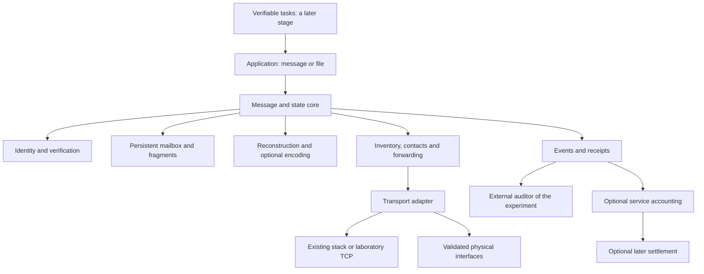

# Dethron — architecture, hypotheses and master validation plan

> **Note, 19/09/2026.** This document cites work that predates Dethron — BitNet/Genesis
> probes, Rust crates, a neural worker, a browser dashboard — which left the tree when the
> repository was prepared for publication. The links to that material have been undone and
> the text kept. The content remains in the git history.

**Version 7 — 17/09/2026. G0–G4 executed; the focus reframed towards an evidence harness and verifiable delivery over Reticulum/LXMF. The main document for continuing.**

This is a proposed specification. It separates existing evidence, architecture decisions
and experiments not yet run. It consolidates the original BitNet/Genesis/Dethron intent
and this investigation's corrections. Where earlier documents leave the future order in
doubt, follow this plan; the historical results keep their dates, configurations and
limits.

## 1. Objective and initial decision

Build or integrate a network in which participating gadgets and servers can hold, forward
and complement parts of messages. The recipient gathers enough information and
reconstructs the original content, even after intermittent contacts and the replacement of
carriers.

The internet is an available path during adoption and expansion. Local paths, radio and
other transports may sustain parts of the service when that path disappears. Full autonomy
depends on physical infrastructure and sufficient contacts. Remuneration may encourage
participation, provided the service is verifiable and funding exists. Efficient storage and
processing are additional objectives requiring measurements of their own.

**Recommended decision:** start from a small scenario and an executable reference.
Implement a difference of our own only after identifying a useful gap. Integrating with an
existing network is a valid outcome.

### Version 7's reframing

Four executed milestones showed that the network properties demonstrated — persistence
after a crash, crossing generations, transport without the IP stack — belong to
Reticulum/LXMF, integrated as the reference. The one milestone designed to measure an
advantage of our own, G2, found a known trade-off with no novelty. The links in the network
vision that outside history has punished hardest, an overlay migrating to its own media and
a token as a supply engine, enter as hypotheses H19–H21 with rejection criteria, not as
premises.

The deliverable becomes, in this order: **an evidence harness reproducible by third
parties** and **verifiable delivery** — a cryptographic receipt from the recipient or an
auditable pendency state, never a "sent" pretending to be "delivered" — as an open source
application layer over Reticulum/LXMF. A network of our own, tokens and distributed
processing are deferred until there is outside use and recognition. The mission is
independent open source; commercial demand is not the gate, but reproduction and acceptance
by people who are not us is.

### First candidate use

Exchanging non-urgent messages and documents between teams with irregular connectivity,
brief contacts and replaceable devices. The benefit sought is completing deliveries that,
with the current alternative, fail or cost excessively. This is a usage hypothesis; there is
no commercial demand or proven adoption yet.

### Guarantees that will not be promised

- Absolute immortality or an impossibility of being switched off.
- Delivery without sufficient information, energy or a future contact.
- Universal survival based on the number "5 %" alone.
- Exact reconstruction of arbitrary data from only a hash or a small seed.
- Electrical savings inferred from tokens, time or bytes without adequate measurement.
- Automatic token appreciation, guaranteed liquidity or universal income.
- **Guaranteed delivery.** No protocol guarantees delivery over intermittent contact. What
  is promised is proof when there is delivery and visible pendency when there is not.

These restrictions define the technical contract; they do not remove the project's intent
of resilience, open participation and autonomy.

### What the evidence can and cannot guarantee

The object's manifest — id, size, digest, part lengths and hashes — is the versioned
representation the historical documents call DNA. It has travelled inside every part since
G2. Spreading parts across nodes improves delivery under loss; spreading receipts improves
obtaining the proof. Neither creates certainty, and each proof has a different reach:

| Proof | Reach | Mechanism |
| --- | --- | --- |
| **Entry** — the object was entrusted to the network | Practically always; it is local to the sender and the first relay | A custody receipt signed by the relay at handoff. Today the handoff is a callback with no signature and no persistence: that is the piece to build |
| **Pendency** — where the object is stuck | Practically always; derived from the custody receipts | Parts at A and C, absent at B, no receipt from the destination after the deadline: an auditable state, not a silence |
| **Exit** — the recipient reconstructed | Exists wherever there was delivery; **reaches the origin only when there is a way back** | A receipt signed by the recipient. Taking it to the origin requires the origin to become reachable again by somebody carrying it. This is the two generals problem; no protocol eliminates it |

A custody receipt is **the relay's claim**: a malicious relay signs and discards. Custody
proves entry; only the recipient's receipt proves exit. The receipt is a few hundred bytes,
so it needs neither parts nor parity: plain replication at every relay is enough. DNA for
the payload, replication for the proof. The honest statement about exit is: *the proof
always exists where there was delivery, and is obtained by whoever reaches any node
carrying it*.

## 2. Starting point: what already exists

| Area | Evidence examined | Use in this architecture |
| --- | --- | --- |
| `v2` | Encrypted units, hashes, references, recipes, storage and limited recovery | Reuse components with adequate contracts and tests |
| Local survival | 3/3 proofs with 20 processes; one survivor with a complete copy recomposes the rest | Reuse the fault-injection infrastructure; do not call it a physical mesh |
| Historical gateway | Roles, plans, an extension, HTTP/SSE; there are simulated discovery, send and authentication paths | Extract requirements; characterise code before reusing it |
| Models | A local comparison of 32 generations; the best mode got 5/8 right with one sustained answer accepted | A later application, with no mandatory role in routing |
| Historical economy | Token and reward plans, and claims without sufficient validation | A source of hypotheses; do not use old scores as economic proof |

The transport in `v2/src/network/node_wire.rs` is restricted to loopback. The current
recovery uses a root and key supplied by the caller and requires the necessary units to be
present. It is not equivalent to opportunistic discovery, redundant encoding, or end-to-end
encrypted messaging through gateways holding no reading key.

Local sources: [evidence map](DETHRON_EVIDENCE_MAP.md), recovery, processes, model
comparison.

## 3. Hypotheses and the tests that could reject them

Every advantage hypothesis below is **undemonstrated in Dethron**. Local evidence about
components is not evidence about the complete service.

| ID | Hypothesis | Test needed | When to reject or reduce the hypothesis |
| --- | --- | --- | --- |
| H01 | There is a useful need not sufficiently met | G0: use, reference and a reproducible gap | The reference meets it and there is no demand for integration |
| H02 | Adopting gadgets adds useful routes | G4/G6: vary quantity, position, contacts and failure domain | More devices only repeat the same dependency or worsen cost |
| H03 | Identity and discovery survive without a mandatory central service | G1/G4: cold start, no external bootstrap, identity kept | The service only works with a warm cache or a hidden server |
| H04 | Fragments from incomplete paths can complete a message | G2: the union of parts from three paths, out of order | The message only arrives when one path already held everything |
| H05 | Redundant encoding improves delivery or cost | G2/G7: replication and exact parts versus an established code | The gain disappears once encoding, metadata and repairs are included |
| H06 | The message crosses generations of nodes | G3: every original and the supervisor replaced | Recovery consults the origin, a snapshot or an undeclared key |
| H07 | Different transports can compose the network | G6: distinct physical media and a real bridge | There are only different TCP ports over the same infrastructure |
| H08 | The internet can become optional | G4/G6: an external cut and an offline start | The declared destinations depend exclusively on the cut path |
| H09 | 5 % of survivors can sustain a defined service | G5: chosen, random, correlated and targeted survivors | The result holds only for a chosen subset, or preserves bytes alone |
| H10 | Atomisation reduces physical storage by at least 5 % | G7: the same data and recovery, all redundancy included | It only reduces the displayed representation, or loses information |
| H11 | The network reduces total energy by at least 5 % | G7: paired electrical runs, equivalent service | The gain sits inside the noise or depends on omitted costs |
| H12 | Processing on mini nodes has a net gain | G8: a verifiable task, local versus distributed | Communication, verification and repetition cancel the benefit |
| H13 | Adaptation/evolution beats a simple policy | G7/G8: the same load, fixed versus adaptive policy on held-out cases | It only wins on the cases used for tuning |
| H14 | Paying increases useful and sustainable supply | G9: a contracted service, cost and availability, subsidy accounted separately | The operator does not cover costs, or supply depends on issuance without demand |
| H15 | Contribution can be accounted for without dominant fraud | G9: duplicates, multiple identities, collusion and forged receipts | The cost or error of verification makes the service unviable |
| H16 | A transferable token adds value to charging | G9: compare credit, conventional charging and a token, partitions included | It only adds cost, speculation or an incompatible external dependency |
| H17 | Open participation increases users' autonomy | G0/G4/pilot: remove the central operator and test portability | Registration, a directory, keys or payment recreate a mandatory dependency |
| H18 | AI applications benefit from the network | After G8: a real task, an identified model, correctness and total cost | The model or the distribution does not beat the reference in the declared use |
| H19 | An overlay born on the internet moves traffic to its own media | The fraction of bytes off the base path, measured with G4's instrument, across adoption | At the declared node count or elapsed time, more than 95 % of bytes stay on the base path. Tor, I2P, Yggdrasil and cjdns all point towards rejection |
| H20 | The proof of delivery reaches the origin in a useful fraction of cases | V1: a receipt replicated at the relays, an intermittent origin, a declared deadline | The origin only obtains the receipt when the destination is simultaneously reachable, or the fraction falls below the declared deadline |
| H21 | Custody receipts allow pendency to be localized without trusting a relay | V1: a relay that signs and discards, a relay that denies having received | The auditor cannot tell real pendency from false custody, or verification costs more than the service |

H19–H21 belong to version 7. A token as a supply engine stays in H14–H16, with the record
that Helium and Filecoin produced abundant supply and minimal demand: a token manufactures
supply, not demand. Decide on a token only after usage is measured under credit or
conventional charging.

"Living cryptography" will be translated into testable requirements of identity, rotation,
revocation and key recovery; not into new cryptographic primitives. "DNA" means a versioned
representation of data and dependencies; its existence implies no learning, no automatic
extraction and no universal compression.

## 4. Recommended architecture

### 4.1. Separation of responsibilities



This is a proposed design, not the structure already implemented. The auditor observes the
execution; it supplies no fragments, keys or answer keys to the core. Accounting does not
interfere with the transport's correctness; future budget-based admission policies stay
explicit at the service boundary.

### 4.2. Implementation decisions

1. **A Rust recovery core in `v2`.** Validate inputs and produce explicit transitions and
   actions. Clock, storage and transport enter through interfaces; business decisions do not
   depend on sleeps or global variables.
2. **A node process with its own state.** It holds an identity, a mailbox, a configuration
   and limits. One process per node suffices for the first local proof; further
   microservices are not needed to test the contract.
3. **Replaceable adapters.** Compare Reticulum/LXMF or BPv7 first; keep transport outside
   the reconstruction logic. Where a solution for a function already exists, integrate it
   and test the boundary. Choose one initial reference rather than implementing several
   stacks at once.
4. **Python/Window as the harness and the first LXMF integration.** G1 implements the
   application's mailbox and transitions in Python/SQLite next to the native API; the
   [decision and its limits](window/G1_INTEGRATION.md) replace the hypothesis of putting
   those first transitions in Rust as well. Create processes, control contacts, inject
   failures and audit. The plan known to the harness must not appear as magical knowledge in
   the router. The router uses observations available to the node.
5. **Persistence with explicit crash semantics.** Assess the current store before choosing
   it for the mailbox and outbox. Recording a delivery and updating state need a
   transactional guarantee, or a demonstrated equivalent protocol. Choose a backend in a
   short documented decision, without assuming that a rename proves durability under any
   power loss.
6. **Observability from the first slice.** Versioned events, a full traffic count, costs and
   failures; dashboards show real records.
7. **Economy and tasks as later modules.** No token, blockchain or LLM is needed to test the
   delivery of a file.

### 4.3. Proposed data contracts

| Object | Essential fields and rules |
| --- | --- |
| Message | Protocol version, unique id, origin and destination, expiry, size, a reference to the manifest, and a resource policy |
| Manifest | An authenticated commitment to the content, version, fragmentation/encoding scheme and parameters; bounded in size |
| Fragment | Message and block id, index or symbol id, scheme, size and bytes; verifiable integrity evidence |
| Inventory | What the node actually holds; announcements bounded, paginated and bound to the correct version |
| Contact | The observed peer, interface, session, deadline, limits and observed capacity; never an invented capacity |
| Receipt | An explicit type: accepted locally, persisted, forwarded or delivered; the issuer and a reference to the obligation |
| Usage | The contracted service, budget, unit, evidence, provisional or final state, and an idempotency key |

Message ids distinguish sends. Content ids may allow deduplication, but they do not prove
origin, freshness or independence of replicas. Do not assume equality of encrypted files is
detectable across different users and keys.

For gateways with no access to the content, authenticate the manifest and the parts over the
transported representation. The recipient also validates the decrypted content. Do not
distribute the recipient's private key so that the gateway can check integrity. The complete
cryptographic construction requires choosing an established format and a review; hashes
alone do not authenticate a sender.

Fragmentation initially simple and bounded. Compare an established recovery code afterwards;
do not implement a home-made variant of RaptorQ or of cryptography. Nodes without sufficient
information may forward existing symbols; generating new repair symbols requires the
appropriate information and algorithm, not merely an identifier.

### 4.4. States and invariants

The conceptual reception flow:

```text
valid manifest -> partial persisted -> sufficient information
-> reconstructed -> validated -> made available to the recipient -> confirmed
```

Expiry, rejection for corruption and resource failure have separate records. An
unsuccessful reconstruction attempt must not delete valid parts. Sending has a queue of its
own: pending, attempted, awaiting confirmation, confirmed or expired. Local persistence is
not final delivery.

Invariants to test:

- Mixing incompatible messages, revisions, parameters or indices does not complete an object.
- Duplicates neither increase the available information nor generate repeated charges.
- A gateway receipt does not replace an authenticated confirmation from the recipient.
- Retransmission is allowed; logical delivery is idempotent. Do not promise exactly-once
  execution of external effects without support from the application.
- A restart may cause a resend; it must not turn an attempt into a proven delivery.
- Metadata, queues, fragments, attempts and working time have explicit limits.
- An unknown version fails clearly; an upgrade does not silently erase old readable data.
- Key rotation preserves the declared policy for old messages; loss and revocation have
  separate tests. A new identity is not the old one merely by sharing its name.

## 5. References and what to compare

| Reference | Function to compare | Limit of the comparison |
| --- | --- | --- |
| Reticulum/LXMF | A heterogeneous network, discovery, messages and propagation | Do not presume it implements exactly our meeting of fragments |
| DTN/BPv7 | Persistent messages over intermittent contacts | A specification does not choose the router, the adapters or the implementation by itself |
| Exact parts and replication | A simple recovery control | Include the storage and traffic of every copy |
| An established erasure or fountain code | Recovery with redundancy | Measure CPU/RAM, metadata, decoding probability and repairs |
| Conventional charging and credits | An economic control | Include operating cost and payment risk during partitions |

G0 chooses which reference to run and records the version, configuration, installation and
limitations. Results documented by the authors are not our benchmarks. If the reference
fails, investigate the configuration and the requirements before calling that failure a
Dethron advantage. The comparison method must give both an equivalent tuning budget and the
same access to messages and contacts.

Primary references already consulted:
[Reticulum](https://markqvist.github.io/Reticulum/manual/networks.html),
[LXMF](https://github.com/markqvist/LXMF),
[BPv7](https://www.rfc-editor.org/rfc/rfc9171.html),
[RaptorQ](https://www.rfc-editor.org/rfc/rfc6330.html),
[Tahoe-LAFS](https://github.com/tahoe-lafs/tahoe-lafs/blob/master/docs/architecture.rst),
[Golem](https://docs.golem.network/docs/golem/overview),
[Filecoin](https://docs.filecoin.io/basics/the-blockchain/proofs).

## 6. Execution order and conditions for advancing

This order preserves G0–G7 from the earlier plan and adds G8/G9. Some requirement and cost
studies may happen early; that does not bring forward any launch of payments.

| Milestone | What to deliver | Criterion for advancing |
| --- | --- | --- |
| G0 — requirement and reference | A frozen configuration, the reference executed, controls, and a gap report | An observable need and a justifiable difference, or a decision to integrate |
| G1 — a persistent message | Envelope, manifest, identity and mailbox/outbox, one local delivery | Corruption rejected, state recovered after a crash, a correct final receipt |
| G2 — complementary paths | Three incomplete routes, out-of-order arrival, repetition and loss | A sufficient union delivers the exact bytes; an insufficient union stays incomplete |
| G3 — generations | Replacing every original, the supervisor included, in cycles | The service continues under declared dependencies, without consulting a hidden source |
| G4 — logical independence | Cutting the external path, a cold start and an alternative bridge | Messages in scope travel over alternative contacts; total isolation produces no false success |
| G5 — survival | **Deferred in v7**: it only makes sense on V3's multi-machine bench; on one host it measures the provisioning, not the network | Results separated by scenario, data, contacts, deadline and capacity |
| G6 — hardware | **Recast in v7 as V3**: media we actually control | Evidence of the media being used and of independent failures; no hidden external path |
| G7 — efficiency and adaptation | **Deferred in v7**: G2 already showed a trade-off, not a gain | A reproducible gain on held-out cases with an equivalent service |
| G8 — processing | **After outside acceptance** | A net benefit after transfer, validation, coordination and repetition |
| G9 — incentives | **After outside acceptance and usage measured without a token** | A verifiable and fundable service; a separate decision on whether a token is needed |

### The V trail — verifiable delivery and harness, version 7's order

| Milestone | What to deliver | Criterion for advancing | The control that must fail |
| --- | --- | --- | --- |
| V1 — receipt return | A custody receipt signed at handoff; the recipient's receipt replicated at the relays; an intermittent origin obtaining the proof from any relay; an auditor deriving pendency from the custody receipts | The origin obtains a valid receipt without direct contact with the destination; an absent receipt after the deadline produces localized pendency, not silence | A handoff without a signature does not count as custody; a custody receipt does not count as delivery; a relay that signs and discards is caught by the absence of the destination's receipt |
| V2 — reproduction by a stranger | A clean clone on a second machine, a pinned environment, one command per milestone, the same verdict | Somebody who did not write the code obtains the verdict and the audit from the clone, without help | An artifact existing only on the origin machine, an undocumented step, or a dependency on the local environment all fail it |
| V3 — multi-machine bench | A local agent per machine executing a pre-declared schedule; the supervisor **does not steer nodes inside the isolated window**; later collection over a channel that is declared and excluded from the measurement; G6 over Ethernet, Wi-Fi and a non-IP serial/USB link | The evidence of G1–G4 holds on distinct devices; the fraction of bytes off the base path measured per machine | A control plane giving IP connectivity during the isolated window invalidates the round; the absence of a positive `netstat` control per machine invalidates the zero |

V1 closes the promise of verifiable delivery. V2 is what separates "we have evidence" from
"evidence others accept". V3 retires the "same host, same OS, same file system" caveat every
milestone carries. Only after V3 does reopening G5 and the network conversation make sense.
Every contribution to Reticulum/LXMF produced by the harness — a defect, a limit or a
measurement — is a first-class result.

G1–G4 and V1–V2 may run as a laboratory of processes. Claiming radio or physical autonomy
requires V3, and only over the accessible media: Ethernet, Wi-Fi, serial/USB and LoRa/ISM.
Phones, other people's routers, cars and satellites have the hardware but not the permission
— the barrier is one of operating system, law and commerce, and no milestone can engineer
around it. The order does not mean testing a blockchain before there is a need; G9 may
conclude that credits or conventional payments are enough.

### The minimal cross-cutting suite

| Test | Expected behaviour |
| --- | --- |
| An absent recipient | No final confirmation; pendency and expiry recorded |
| A corrupted fragment followed by a valid replica | Reject the first, accept the later valid information |
| A missing manifest or a missing necessary key | An explicit failure or pendency, with no content inferred |
| A manifest of another version | Reject the mixture even where partial ids appear to coincide |
| Many duplicates | The resource limit respected; completeness and charging do not increase |
| A crash before and after persistence and confirmation | A coherent state and a safe resend |
| An incorrect clock or a rollback | A documented temporal policy; the deadline is not silently extended |
| A full queue or disk, or an excessive payload | An explicit refusal, preserving the data already confirmed as durable |
| The single gateway withdrawn | No false claim of an alternative path |
| A key or identity rotated or revoked | The declared policy applied to new and old messages |
| A false inventory, or a peer that stops cooperating | Absent data is not counted; retry in a bounded way or wait |
| A receipt altered, replayed, or belonging to another recipient | No undue final delivery or charge |
| Receipts signed by colluding participants | A signature alone is not accepted as sufficient proof of economic service |

For all of them: the test must observe behaviour. Finding the word "mock" in the code helps
a review, but does not replace a control that detects a false delivery.

## 7. The first concrete campaign

### Proposed initial profile: `gateway-dev-v1`

A development configuration, not a global benchmark and not an unprecedented evaluation:

- Five local processes: origin O, carriers A/B/C and destination D.
- Three deterministic messages of 1 KiB, 64 KiB and 1 MiB, to test distinct sizes. These
  volumes do not settle the feasibility of sending over any given radio.
- Basic case: split each transported object into three sets of parts; no carrier holds the
  complete object.
- The origin distributes, finishes, and its directory becomes inaccessible to the active flow.
- A meets D; D restarts; B and C meet D at different moments.
- Negative variant: permanently withdraw an indispensable part, keeping duplicates of the
  others; complete reconstruction must not occur.
- Continuity variant: replace carriers before delivery completes, declaring precisely which
  data survived and how it was restored.
- Proposed laboratory deadline: 120 seconds after distribution. Freeze that value before the
  round; later adjustments create a new version.

The harness keeps the originals only as a reference inaccessible to the candidate. The
expected result is equality of bytes and hash, confirmation at the destination, and an
intact record of the flow. Messages in the negative variant must stay incomplete until the
deadline or expiry. Do not use the answer key to reconstruct the content.

Start at G0 by reproducing the equivalent function in the chosen reference. If it does not
expose fragments through the API, document that and build the comparison at object level
with an equivalent adapter; do not declare that an incompatible test proves the reference
incapable. The variant with encoding comes after the control with exact parts, changing one
mechanism at a time.

The G0 scope with **whole messages** was built and executed on 15/09/2026:
[configuration, results and decision](window/G0_REFERENCE.md). Reticulum/LXMF met the local
requirement; continue with integration in G1. The complementary-parts scenario described
above remains proposed for G2.

## 8. Code structure and incremental delivery

Keep `v2` as the reusable core and `window` as harness and adapter. The names below are
proposals and need confirming against G0's decision. Do not reorganise the whole repository
and do not import old gateways without validation.

| Slice | Proposed files | The test that must fail first |
| --- | --- | --- |
| Reference harness | `window/run_gateway_probe.py`, `window/gateway_reference.py`, `window/gateway_audit.py`, `window/tests/test_gateway_audit.py` | A sender's log without confirmation from the destination cannot pass |
| Envelope | `v2/src/network/message_envelope.rs`, `v2/tests/message_envelope.rs` | Tampering with content, version or destination is rejected |
| Manifest and parts | `v2/src/network/message_manifest.rs`, `v2/tests/message_manifest.rs` | Mixing messages and counting duplicates does not complete an object |
| Mailbox and outbox | `v2/src/network/message_inbox.rs`, `v2/src/network/message_outbox.rs`, and their tests | A restart loses state, or logical delivery duplicates |
| Inventory | `v2/src/network/fragment_inventory.rs`, `v2/tests/fragment_inventory.rs` | The requester asks for the wrong complement, or accepts an inventory without data |
| Contacts | `v2/src/network/contact_transport.rs`, `v2/tests/contact_transport.rs` | Separate contacts do not complete the positive flow |
| Reconstruction | `v2/src/network/message_reassembly.rs`, `v2/tests/message_reassembly.rs` | Sufficient parts fail to recompose, or insufficient ones are accepted |
| Policy | `v2/src/network/forwarding_policy.rs`, `v2/tests/forwarding_policy.rs` | An unbounded loop or resend exceeds the budget |
| Future accounting | `v2/src/network/usage_receipt.rs`, `v2/tests/usage_receipt.rs` | The same service produces a duplicate credit, or a conflicting offline spend is finalised |

Create submodules by responsibility where needed; every code and test file should stay under
200 lines. Integration tests and test actors must not become one monolithic file mixing
transport, audit and economy.

### The mandatory cycle per behaviour

1. A minimal interface and a contract test.
2. Run it and observe the failure through behaviour, not through a missing import or file.
3. Implement the smallest change that passes.
4. Run the test and the relevant suite; keep the previous experiment executable.
5. Refactor with green tests, check file sizes, and repeat validation only where something
   changed or a risk is still unresolved.

Proposed commands, **only after creating the corresponding files**:

```powershell
# At the repository root
$env:PYTHONPATH='window'
python -m pytest window/tests/test_gateway_audit.py -q

# Inside v2; substitute the name of the slice being worked on
cargo test --locked --offline --test message_envelope
cargo test --locked --offline
cargo fmt --check
cargo clippy --locked --offline --all-targets -- -D warnings
```

Offline mode requires dependencies to be available in advance; a failure caused by a missing
dependency is not a functional failure. Record the environment preparation separately. None
of these proposed test commands was run here.

## 9. Autonomy and 5 %: further requirements

Define the denominator: devices, processes, regions or capacity. Fix the set before the
losses. Separate process survival, recovered data, available service and the capacity to
regenerate.

Test chosen, random, shared-domain and critical-point losses; distinguish simultaneous from
gradual ones with time to repair. Keys, bootstrap and the supervisor also enter the
inventory of dependencies. Do not restore nodes with data hidden from the evaluator.

A bounded example: 100 nodes with uniform storage `s`, one object of `M` bytes of arbitrary
information and no external source. Requiring recovery from **any five** implies `5s >= M`,
hence `100s >= 20M`. This shows the cost of the strong contract; it is not a universal limit
on probabilistic policies or on gradual repair. Sufficient redundancy still does not create
contact between the nodes.

Automatically disconnecting from the internet needs an explicit policy and observed
capacity: destinations, deadlines and queues served by other means. Test it cold, with no
mandatory central service, and with the alternative lost afterwards. Record whether the
policy allows a return to the internet or keeps voluntary isolation. Do not activate a cut
on real equipment as a consequence of editing this plan.

Details: [autonomy contract](DETHRON_AUTONOMY_CONTRACT.md).

## 10. Costs, processing and economy

### Storage and energy

Compare the same original information and the same guarantees. Add up payload, indices,
manifests, authentication, replicas, repair symbols and the relevant physical footprint.
Storage freed does not automatically imply less electrical energy. Measure joules of CPU,
radio, disk, maintenance and the idleness attributable to the load.

The three percentages are independent: 5 % of nodes surviving, 5 % of bytes saved and 5 % of
electricity saved. None demonstrates the others. To claim a saving of at least 5 %, the
comparison and its uncertainty must sustain that threshold; without an adequate instrument
and precision, declare energy unmeasured.

### Processing

In G8, choose a divisible task with a deterministic reference and verify the complete
result. Run it locally and on real nodes, including communication, checking and
recomputation after failures. Do not pay for busy CPU as a substitute for a result.
Splitting texts and concatenating answers does not demonstrate LLM sharding.

### Remuneration and token

Define the buyer, the service, the budget and the proof before any token issuance or price.
Separate service revenue, subsidy and asset trading. The operator's result includes energy,
network, wear, operations and the cost of charging.

Simulate multiple identities, collusion, fabricated traffic, data loss, replayed receipts
and double spending. Laboratory credits are neither income nor a tradable asset. Signed
receipts alone do not prove economic usefulness.

Partitions require telling a provisional promise apart from final settlement. If an external
blockchain turns out to be necessary, declare the dependency and what stays offline. Do not
create a consensus of our own merely to hide that limitation. Surviving with 5 % does not
demonstrate the security or availability of a consensus system.

More detail in [incentives](DETHRON_INCENTIVES.md). Real payments, a token launch and a
financial pilot are not actions of this documentary delivery.

A precedent recorded in version 7: Helium paid for coverage in a token and obtained abundant
coverage with minimal usage, installed where it was cheap rather than where it was useful;
Filecoin repeated the pattern with storage. A token manufactures supply, not demand. Hence
G9 sits after usage measured without a token.

## 11. How to measure without repeating the history's unreal tests

Every execution must save the configuration, the versions, the hashes of code and binaries,
the dependencies, the topology, the failure calendar and the raw records. Events must
identify the process or device, the session, the message, the medium and the observed
result. Preserve partial files and error statuses; new destinations avoid overwriting
evidence. Hashes help track versions; they do not authenticate a whole execution.

The auditor checks reception and content independently of the sender's success counters.
Inject a false success and confirm the auditor rejects it. A positive test without negative
controls is not enough. Distinguish a controlled laboratory, hardware, and a field
deployment in every report.

Count **every** original message: delivered on time, late, pending, expired, rejected and
undue. Eligibility and topology appear separately; do not exclude unreachable destinations
in order to improve the percentage.

Separate development from held-out scenarios. Freeze the configuration, the criteria and the
policy before the evaluation; adjusted versions get a new round. Alternate the order of the
variants and repeat paired scenarios. Failures at the same place, or messages from the same
experiment, are correlated; do not treat them as independent proofs of global behaviour.
Report the distribution and the uncertainty.

Results of interest: intact delivery within the deadline, delay, traffic per useful byte,
physical bytes, peak RAM, repair time and total joules. For remuneration, add fraud accepted
and rejected, the cost of verification and the net result. For adoption, measure active
participants and the real diversity of the paths, not merely downloads, generated identities
or the world population of gadgets.

## 12. Decisions to continue, integrate or abandon

**Permanent rule for advancing:** before each milestone, re-assess the previous one's
evidence. On closing each milestone, record: the criteria met and unmet, the negative
controls, the failures and limits, the concrete usefulness of the next experiment, the
additional cost, and a decision to continue, integrate, reduce or stop. Green tests
demonstrate correctness within the scope, not novelty, demand or economic advantage. Where
there is a correctness failure or an inconclusive assessment, resolve it or reduce the scope
before increasing the ambition. No milestone automatically approves the next.

| Finding | Decision |
| --- | --- |
| The reference meets the need and there is no useful gap | Integrate or use the reference; close any equivalent reimplementation |
| A correctness failure in a slice | Fix or remove the mechanism; do not increase scale to hide a failure |
| It works only under restricted conditions | Publish the restricted contract; assess whether it still serves anybody |
| A reproducible improvement on held-out scenarios | A bounded pilot with explicit resources and criteria |
| No technical gain, but demand for ease of use | Validate the integration or product and its operating cost |
| No gain and no concrete demand | Archive the result and abandon the product or hypothesis in that scope |
| The token depends on appreciation or fictitious work | Abandon the token; re-assess the service and charging separately |

There is no obligation to prove every hypothesis in order to deliver a bounded service.
Neither is there a reason to keep a rejected hypothesis in order to preserve the narrative.
Every decision must say which hypothesis it affected and which components remain useful.

## 13. Next action and what concludes the first stage

**G0 concluded within the documented scope:** [reference and results](window/G0_REFERENCE.md).
**G1 satisfactory in the laboratory:** [integration, results and assessment](window/G1_INTEGRATION.md).
**G2 closed:** [exact parts and the widened paired comparison](window/G2_PARTS.md).
**G3 executed:** [generations of nodes and supervisors](window/G3_GENERATIONS.md).
**G4 executed:** [independence from the IP stack and the cut controls](window/G4_INDEPENDENCE.md).
**Version 7 reframing:** harness and verifiable delivery.
**V1 executed in both halves:** [custody, proof of entry and pendency](window/V1_CUSTODY.md)
and [a receipt returning to an origin never online with the destination](window/V1_RECEIPT_RETURN.md).
The gap recorded in every milestone — the receipt not returning to the offline origin — is
closed within the laboratory scope.

**V2, reproduction by a stranger** — [guide, prerequisites and expected results](window/V2_REPRODUCTION.md),
with the `window/run_v2_reproduction.py` runner:

- On 17/09/2026 the repository became clonable: a clean clone on this machine reproduced the
  fast suite, and the eight real paths passed on the committed tree.
- On 17/09/2026 V2 was executed by another person on another machine for the first time and
  **failed**, with seven of the eight paths reproducing an identical verdict. The failures
  exposed did not belong to the machine: the suite demanded Rust without detecting its
  absence; the guide used syntax that only works in PowerShell and reported green for a test
  that skipped itself; and G3 hit a defect in **LXMF 1.1.1** — `generate_stamp` discards a
  valid stamp with `ZeroDivisionError` when the search finishes without the clock advancing,
  silently killing the thread that generates the peering key and deferring every sync. The
  frequency depends on the machine's clock granularity, which explains why it looked like a
  local problem; raising the stamp cost does not solve it. The same `traceback` was in this
  machine's artifacts, in rounds that passed by timing luck. All were fixed or worked
  around, with a test that warns once upstream fixes it.
- The same command from a clone on a 135-character path failed all eight with
  `inconclusive`: Windows' 260-character limit stopped Reticulum writing into `rns/storage`.
  The runner now measures the path and refuses before running, and the guide requires a short
  path — a prerequisite the working tree would never have revealed.
- After the corrections, the complete execution in a single pass **passed** on 18/09/2026:
  verdict `v2_pass` in 58.0 minutes, eight paths with the declared verdict and a green suite.
  **V2 is closed** within the scope of its own criterion — reproduction on an independent
  machine by somebody who did not write the code, following the document alone; not by a
  stranger with no contact with the author. Execution by another person on another machine
  has still not happened.

**V3a executed, and not closed**, on 18/09/2026:
[windows opened 0.007 s apart](window/V3A_BENCH.md) with no live channel, the control channel
sealed on both, the object delivered and audited over non-loopback addresses. The verdict,
however, is `v3a_pass_without_machine_evidence`: the agents did not yet record host
identity, and **that the two folders ran on different machines remains the operator's
observation, not evidence** — which this project does not accept.

**V3c approved** the same day, and it is what settles the question: [a 16 KiB object crossed
between the two machines over a Bluetooth SPP link](window/V3C_BENCH.md), with the
recipient's node proved — by the configuration file it wrote itself — to hold no IP
interface, and the machines proved distinct by processor, name and disjoint addresses.
Verdict `v3c_scoped_pass`. **The single-host caveat leaves G0–V1**, and there is a run in
which verifiable delivery did not use the internet stack. This is not H19: traffic migrating
under scale is a different question, and Bluetooth shares radio and band with Wi-Fi, so what
was proved is the absence of IP, not the absence of a common failure domain. V3b, a second
physical medium over an Ethernet cable, was dropped: Wi-Fi and Ethernet both carry IP, and
proving cable diversity is not proving medium diversity.

An advantage of Dethron's own has still not been demonstrated, and version 7 stops requiring
that in order to continue.

The criteria used to conclude G0 were:

1. A short specification of the service, the limits and the contact profile.
2. A record of the choice of reference and persistence backend, with reasons.
3. A reproducible configuration, environment preparation and evidence of the controls.
4. A report saying: meets, does not meet for a known cause, or inconclusive.
5. Where there is a gap, a behavioural test of the first slice and an implementation plan.

Closing G0 is not a proof of radio, of 5 %, of savings or of a market. Those conditions
belong to later milestones. The software must stay executable at the end of each slice, even
when an experiment rejects the hypothesis.

## 14. Supporting documentation and the state of this delivery

[Index](README.md) · [Direction](DETHRON_NETWORK_DIRECTION.md) ·
[Usefulness](DETHRON_UTILITY_VALIDATION.md) · [Autonomy](DETHRON_AUTONOMY_CONTRACT.md) ·
[Earlier G0–G7 plan](DETHRON_VALIDATION_PLAN.md) ·
[Evidence](DETHRON_EVIDENCE_MAP.md) · [Incentives](DETHRON_INCENTIVES.md).

The master plan was followed by the execution of [G0](window/G0_REFERENCE.md), with a
harness of real processes, a frozen configuration and an audit of the received packets. G1
added real integration with a transactional mailbox and authenticated receipts; G2 closed
with the paired comparison of three policies under route loss; G3 crossed two complete
generations of carriers and four supervisors; G4 delivered the object with no IP interface
at all, with a total cut and a reversible cut as controls. Version 7 reframes the
deliverable towards a harness and verifiable delivery: V1 executed custody signed by the
relays with derived pendency, and the recipient's receipt returned to an origin that was
never online with it, with proof pendency visible when the visited relay did not hold it; V2
and V3 are the next trail; G5 and G7 are deferred, G8 and G9 come after outside acceptance.
These results sustain small comparative experiments, without proving novelty or global
viability.
