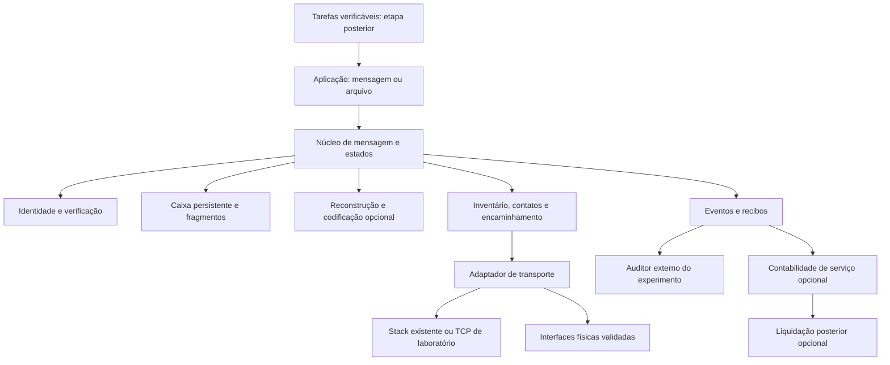

# Dethron — arquitetura, hipóteses e plano mestre de validação

**Versão 7 — 17/09/2026. G0–G4 executados; foco reenquadrado para harness de evidência e entrega verificável sobre Reticulum/LXMF. Documento principal para continuar.**

Esta é uma especificação proposta. Distingue evidência existente, decisões de
arquitetura e experimentos ainda não executados. Consolida a intenção original
BitNet/Genesis/Dethron e as correções desta investigação. Quando houver dúvida
sobre a ordem futura nos documentos anteriores, seguir este plano; os resultados
históricos mantêm suas datas, configurações e limites.

## 1. Objetivo e decisão inicial

Construir ou integrar uma rede em que gadgets e servidores participantes possam
guardar, encaminhar e complementar partes de mensagens. O destinatário reúne
informação suficiente e reconstrói o conteúdo original, mesmo após contatos
intermitentes e substituição de transportadores.

A internet é uma via disponível durante a adoção e expansão. Caminhos locais,
rádio e outros transportes podem sustentar partes do serviço quando essa via
desaparece. Autonomia integral depende de infraestrutura física e contatos
suficientes. Remuneração pode incentivar participação, desde que o serviço seja
verificável e exista financiamento. Armazenamento e processamento eficientes
são objetivos adicionais que exigem suas próprias medições.

**Decisão recomendada:** começar por um cenário pequeno e uma referência
executável. Implementar uma diferença própria somente depois de identificar
uma lacuna útil. Uma integração com uma rede existente é um resultado válido.

### Reenquadramento da versão 7

Quatro marcos executados mostraram que as propriedades de rede demonstradas —
persistência após crash, travessia de gerações, transporte sem a pilha IP — são
do Reticulum/LXMF, integrado como referência. O único marco desenhado para medir
vantagem própria, G2, encontrou um compromisso conhecido, sem novidade. Os elos
da visão de rede que a história externa mais castigou, migração de overlay para
meios próprios e token como motor de oferta, entram como hipóteses H19–H21 com
critério de rejeição, não como premissas.

O entregável passa a ser, nesta ordem: **um harness de evidência reproduzível por
terceiros** e **entrega verificável** — recibo criptográfico do destinatário ou
estado de pendência auditável, nunca um "enviado" fingindo ser "entregue" — como
camada de aplicação open source sobre Reticulum/LXMF. Uma rede própria, tokens e
processamento distribuído ficam adiados até haver uso e reconhecimento externos.
A missão é open source independente; demanda comercial não é o portão, mas
reprodução e aceitação por quem não somos nós, sim.

### Primeiro uso candidato

Trocar mensagens e documentos não urgentes entre equipes com conexão irregular,
contatos breves e dispositivos substituíveis. O benefício procurado é completar
entregas que, com a alternativa atual, falham ou custam excessivamente.
É uma hipótese de uso; ainda não há demanda comercial ou adoção comprovada.

### Garantias que não serão prometidas

- Imortalidade absoluta ou impossibilidade de desligamento.
- Entrega sem informação suficiente, energia ou contato futuro.
- Sobrevivência universal baseada apenas no número "5%".
- Reconstrução exata de dados arbitrários usando somente um hash ou semente pequena.
- Economia elétrica inferida de tokens, tempo ou bytes sem medição adequada.
- Valorização automática de token, liquidez garantida ou renda universal.
- **Entrega garantida.** Nenhum protocolo garante entrega sobre contato
  intermitente. O que se promete é prova quando há entrega e pendência visível
  quando não há.

Essas restrições definem o contrato técnico; não retiram a intenção de
resiliência, participação aberta e autonomia do projeto.

### O que a evidência pode e não pode garantir

O manifesto do objeto — id, tamanho, digest, comprimentos e hashes das partes —
é a representação versionada que os documentos históricos chamam de DNA. Ele já
viaja dentro de cada parte desde G2. Espalhar partes entre nós melhora a entrega
sob perda; espalhar recibos melhora a obtenção da prova. Nenhum dos dois cria
certeza, e cada prova tem alcance diferente:

| Prova | Alcance | Mecanismo |
| --- | --- | --- |
| **Entrada** — o objeto foi confiado à rede | Praticamente sempre; é local ao remetente e ao primeiro relé | Recibo de custódia assinado pelo relé no handoff. Hoje o handoff é um callback sem assinatura nem persistência: é a peça a construir |
| **Pendência** — onde o objeto está parado | Praticamente sempre; deriva dos recibos de custódia | Partes em A e C, ausente em B, sem recibo do destino após o prazo: estado auditável, não silêncio |
| **Saída** — o destinatário reconstruiu | Existe sempre que há entrega; **chega à origem só quando há caminho de volta** | Recibo assinado pelo destinatário. Levá-lo à origem exige que ela volte a ser alcançável por alguém que o carregue. É o problema dos dois generais; não há protocolo que o elimine |

Recibo de custódia é **alegação do relé**: um relé malicioso assina e descarta.
Custódia prova entrada; só o recibo do destinatário prova saída. O recibo tem
poucas centenas de bytes, então dispensa partes e paridade: réplica simples em
todo relé basta. DNA para a carga, réplica para a prova. A afirmação honesta
sobre saída é: *a prova sempre existe onde houve entrega e é obtida por quem
alcançar qualquer nó que a carregue*.

## 2. Ponto de partida: o que já existe

| Área | Evidência examinada | Uso nesta arquitetura |
| --- | --- | --- |
| `v2` | Unidades cifradas, hashes, referências, receitas, armazenamento e recuperação limitada | Reaproveitar componentes com contratos e testes adequados |
| Sobrevivência local | 3/3 provas com 20 processos; um sobrevivente com cópia completa recompõe os demais | Reutilizar infraestrutura de injeção de falhas; não chamar de mesh físico |
| Gateway histórico | Papéis, planos, extensão, HTTP/SSE; há caminhos simulados de descoberta/envio/autenticação | Extrair requisitos; caracterizar código antes de reaproveitar |
| Modelos | Comparação local de 32 gerações; melhor modo teve 5/8 acertos e uma resposta sustentada aceita | Aplicação posterior, sem papel obrigatório no roteamento |
| Economia histórica | Planos de tokens/recompensas e alegações sem validação suficiente | Fonte de hipóteses; não usar placares antigos como prova econômica |

O transporte de `v2/src/network/node_wire.rs` é restrito a loopback. A recuperação
atual usa raiz/chave fornecidas pelo chamador e exige unidades necessárias
presentes. Não equivale a descoberta oportunista, codificação redundante ou
mensageria cifrada ponta a ponta através de gateways sem chave de leitura.

Fontes locais: [mapa de evidências](DETHRON_EVIDENCE_MAP.md),
[recuperação](v2/CONNECTED_RECOVERY.md), [processos](window/PROCESS_SURVIVAL.md),
[comparação de modelo](window/RESPONSE_COMPARISON.md).

## 3. Hipóteses e testes que podem rejeitá-las

Todas as hipóteses de vantagem abaixo estão **não demonstradas no Dethron**.
Evidência local de componentes não é evidência do serviço completo.

| ID | Hipótese | Teste necessário | Quando rejeitar ou reduzir a hipótese |
| --- | --- | --- | --- |
| H01 | Existe necessidade útil não atendida suficientemente | G0: uso, referência e lacuna reproduzível | Referência atende e não há demanda de integração |
| H02 | A adoção de gadgets acrescenta rotas úteis | G4/G6: variar quantidade, posição, contatos e domínio de falha | Mais dispositivos só repetem a mesma dependência ou pioram custo |
| H03 | Identidade e descoberta sobrevivem sem serviço central obrigatório | G1/G4: início a frio, bootstrap externo ausente, identidade mantida | Serviço só funciona com cache quente ou servidor oculto |
| H04 | Fragmentos de caminhos incompletos podem completar uma mensagem | G2: união de partes de três caminhos, fora de ordem | Mensagem só chega quando um caminho já continha tudo |
| H05 | Codificação redundante melhora entrega ou custo | G2/G7: réplica/partes exatas versus código estabelecido | Ganho desaparece ao incluir codificação, metadados e reparos |
| H06 | A mensagem atravessa gerações de nós | G3: todos os originais e supervisor substituídos | Recuperação consulta origem, snapshot ou chave não declarada |
| H07 | Transportes diferentes podem compor a rede | G6: meios físicos distintos e ponte real | Só há portas TCP diferentes sobre a mesma infraestrutura |
| H08 | A internet pode tornar-se opcional | G4/G6: corte externo e arranque offline | Destinos declarados dependem exclusivamente da via cortada |
| H09 | 5% de sobreviventes podem manter um serviço definido | G5: sobreviventes escolhidos, aleatórios, correlacionados e direcionados | Resultado vale apenas para subconjunto escolhido ou só preserva bytes |
| H10 | Atomização reduz ao menos 5% do armazenamento físico | G7: mesmos dados e recuperação, toda redundância incluída | Só reduz representação exibida ou perde informação |
| H11 | A rede reduz ao menos 5% da energia total | G7: ensaios elétricos pareados, serviço equivalente | Ganho fica dentro do ruído ou depende de custos omitidos |
| H12 | Processamento em mini nós tem ganho líquido | G8: tarefa verificável local versus distribuída | Comunicação, verificação e repetição anulam o benefício |
| H13 | Adaptação/evolução supera política simples | G7/G8: mesma carga, política fixa versus adaptativa em casos reservados | Só ganha nos casos usados para ajuste |
| H14 | Remunerar aumenta oferta útil e sustentável | G9: serviço contratado, custo e disponibilidade, subsídio separado | Operador não cobre custos ou oferta depende de emissão sem demanda |
| H15 | É possível contabilizar contribuição sem fraude dominante | G9: duplicatas, identidades múltiplas, conluio e recibos falsos | Custo/erro da verificação torna o serviço inviável |
| H16 | Token transferível agrega valor à cobrança | G9: comparar crédito, cobrança convencional e token, incluindo partições | Só adiciona custo, especulação ou dependência externa incompatível |
| H17 | Participação aberta aumenta autonomia dos usuários | G0/G4/piloto: remover operador central e testar portabilidade | Cadastro, diretório, chaves ou pagamento recriam dependência obrigatória |
| H18 | Aplicações de IA se beneficiam da rede | Após G8: tarefa real, modelo identificado, correção e custo total | Modelo ou distribuição não supera referência no uso declarado |
| H19 | Um overlay nascido sobre a internet move tráfego para meios próprios | Fração de bytes fora da via base, medida pelo instrumento do G4, ao longo da adoção | Atingido o número declarado de nós ou de tempo, mais de 95% dos bytes seguem na via base. Tor, I2P, Yggdrasil e cjdns apontam para a rejeição |
| H20 | A prova de entrega alcança a origem em fração útil dos casos | V1: recibo replicado nos relés, origem intermitente, prazo declarado | Origem só obtém o recibo quando o destino está simultaneamente alcançável, ou a fração fica abaixo do prazo declarado |
| H21 | Recibos de custódia permitem localizar pendência sem confiar em um relé | V1: relé que assina e descarta, relé que nega ter recebido | Auditor não distingue pendência real de custódia falsa, ou a verificação custa mais que o serviço |

H19–H21 são da versão 7. Token como motor de oferta segue em H14–H16, com o
registro de que Helium e Filecoin produziram oferta abundante e demanda mínima:
token manufatura oferta, não demanda. Decidir token só após uso medido em
crédito ou cobrança convencional.

"Criptografia viva" será traduzida em requisitos testáveis de identidade, rotação,
revogação e recuperação de chaves; não em primitivas criptográficas novas.
"DNA" significa uma representação versionada de dados e dependências; sua
existência não implica aprendizado, extração automática ou compressão universal.

## 4. Arquitetura recomendada

### 4.1. Separação de responsabilidades



É um desenho proposto, não a estrutura já implementada. O auditor observa a
execução; não fornece fragmentos, chaves ou gabaritos ao núcleo. A contabilidade
não interfere na correção do transporte; futuras políticas de admissão por
orçamento ficam explícitas na fronteira do serviço.

### 4.2. Decisões de implementação

1. **Núcleo de recuperação em Rust no `v2`.** Validar entradas e produzir
   transições/ações explícitas. Relógio, armazenamento e transporte entram por
   interfaces; decisões de negócio não dependem de sleeps ou variáveis globais.
2. **Processo de nó com estado próprio.** Possui identidade, caixa, configuração
   e limites. Um processo por nó é suficiente para a primeira prova local;
   microserviços adicionais não são necessários para testar o contrato.
3. **Adaptadores substituíveis.** Comparar primeiro Reticulum/LXMF ou BPv7;
   manter transporte fora da lógica de reconstrução. Se já houver solução para
   uma função, integrá-la e testar a fronteira. Escolher uma referência inicial,
   não implementar simultaneamente várias stacks.
4. **Python/Window como harness e integração inicial com LXMF.** G1 implementa
   caixa/transições de aplicação em Python/SQLite, junto à API nativa; a
   [decisão e seus limites](window/G1_INTEGRATION.md) substituem a hipótese de
   colocar essas primeiras transições também em Rust. Criar processos, controlar contatos, injetar
   falhas e auditar. O plano conhecido pelo harness não pode aparecer como
   conhecimento mágico do roteador. O roteador usa observações disponíveis ao nó.
5. **Persistência com semântica de crash explícita.** Avaliar o store atual antes
   de escolhê-lo para caixa/outbox. Registro de entrega e atualização de estado
   precisam de garantia transacional ou protocolo equivalente demonstrado.
   Escolher backend em decisão curta documentada, sem assumir que rename prova
   durabilidade em qualquer queda de energia.
6. **Observabilidade desde a primeira fatia.** Eventos versionados, contagem de
   tráfego completo, custos e falhas; dashboards apresentam registros reais.
7. **Economia e tarefas como módulos posteriores.** Nenhum token, blockchain ou
   LLM é necessário para testar a entrega de um arquivo.

### 4.3. Contratos de dados propostos

| Objeto | Campos/regras essenciais |
| --- | --- |
| Mensagem | Versão de protocolo, ID único, origem/destino, expiração, tamanho, referência ao manifesto e política de recursos |
| Manifesto | Compromisso autenticado com conteúdo, versão, esquema de fragmentação/codificação e parâmetros; tamanho limitado |
| Fragmento | ID de mensagem/bloco, índice ou ID de símbolo, esquema, tamanho e bytes; evidência de integridade verificável |
| Inventário | O que o nó realmente conserva; anúncios limitados, paginados e vinculados à versão correta |
| Contato | Par observado, interface, sessão, prazo, limites e capacidade observada; nunca capacidade inventada |
| Recibo | Tipo explícito: aceito localmente, persistido, encaminhado ou entregue; emissor e referência à obrigação |
| Uso | Serviço contratado, orçamento, unidade, evidência, estado provisório/final e chave de idempotência |

IDs de mensagem distinguem envios. IDs de conteúdo podem permitir deduplicação,
mas não provam origem, frescor ou independência de réplicas. Não assumir que
igualdade de arquivos cifrados seja detectável entre usuários/chaves diferentes.

Para gateways sem acesso ao conteúdo, autenticar manifesto e partes sobre a
representação transportada. O destinatário valida também o conteúdo decifrado.
Não distribuir a chave privada do destinatário para que o gateway possa verificar
integridade. A construção criptográfica completa exige escolha de formato
estabelecido e revisão; hashes isolados não autenticam um remetente.

Fragmentação inicialmente simples e limitada. Depois comparar código estabelecido
de recuperação; não implementar uma variante caseira de RaptorQ ou criptografia.
Nós sem informação suficiente podem encaminhar símbolos existentes; gerar novos
símbolos de reparo exige informação e algoritmo apropriados, não só um identificador.

### 4.4. Estados e invariantes

Fluxo conceitual de recepção:

```text
manifesto válido -> parcial persistido -> informação suficiente
-> reconstruído -> validado -> disponibilizado ao destinatário -> confirmado
```

Expiração, rejeição por corrupção e falha de recursos têm registros separados.
Uma tentativa de reconstrução malsucedida não deve apagar partes válidas.
O envio tem fila própria: pendente, tentativa, aguardando confirmação, confirmado
ou expirado. Persistência local não equivale a entrega final.

Invariantes a testar:

- Misturar mensagens, revisões, parâmetros ou índices incompatíveis não completa um objeto.
- Duplicatas não aumentam a informação disponível nem geram cobrança repetida.
- Recibo do gateway não substitui confirmação autenticada do destinatário.
- Retransmissão é permitida; a entrega lógica é idempotente. Não prometer
  exatamente uma execução de efeitos externos sem suporte da aplicação.
- Reinício pode causar reenvio; não pode converter uma tentativa em entrega comprovada.
- Metadados, filas, fragmentos, tentativas e tempo de trabalho têm limites explícitos.
- Versão desconhecida falha claramente; atualização não apaga silenciosamente dados legíveis antigos.
- Rotação de chave preserva a política declarada para mensagens antigas;
  perda/revogação têm testes distintos. Nova identidade não é a antiga por ter o mesmo nome.

## 5. Referências e o que comparar

| Referência | Função a comparar | Limite da comparação |
| --- | --- | --- |
| Reticulum/LXMF | Rede heterogênea, descoberta, mensagens e propagação | Não presumir que implementa exatamente nosso encontro de fragmentos |
| DTN/BPv7 | Mensagens persistentes sobre contatos intermitentes | Especificação não escolhe sozinha roteador, adaptadores ou implementação |
| Partes exatas e replicação | Controle simples de recuperação | Incluir armazenamento/tráfego de todas as cópias |
| Código estabelecido de apagamento/fountain | Recuperação com redundância | Medir CPU/RAM, metadados, probabilidade de decodificação e reparos |
| Cobrança convencional/créditos | Controle econômico | Incluir custo operacional e risco de pagamentos durante partições |

G0 escolhe qual referência executar e registra versão, configuração, instalação
e limitações. Resultados documentados pelos autores não são nossos benchmarks.
Se a referência falhar, investigar configuração e requisitos antes de chamar a
falha de vantagem do Dethron. O método de comparação deve dar a ambos orçamento
equivalente de ajuste e o mesmo acesso às mensagens e contatos.

Referências primárias já consultadas:
[Reticulum](https://markqvist.github.io/Reticulum/manual/networks.html),
[LXMF](https://github.com/markqvist/LXMF),
[BPv7](https://www.rfc-editor.org/rfc/rfc9171.html),
[RaptorQ](https://www.rfc-editor.org/rfc/rfc6330.html),
[Tahoe-LAFS](https://github.com/tahoe-lafs/tahoe-lafs/blob/master/docs/architecture.rst),
[Golem](https://docs.golem.network/docs/golem/overview),
[Filecoin](https://docs.filecoin.io/basics/the-blockchain/proofs).

## 6. Ordem de execução e condições para avançar

Esta ordem preserva G0–G7 do plano anterior e acrescenta G8/G9. Alguns estudos
de requisito/custo podem ocorrer cedo; isso não antecipa lançamento de pagamentos.

| Marco | O que entregar | Critério para avançar |
| --- | --- | --- |
| G0 — requisito e referência | Configuração congelada, referência executada, controles e relatório de lacuna | Necessidade observável e diferença justificável, ou decisão de integrar |
| G1 — mensagem persistente | Envelope, manifesto, identidade e caixa/outbox, uma entrega local | Corrupção rejeitada, estado recuperado após crash, recibo final correto |
| G2 — caminhos complementares | Três rotas incompletas, chegada fora de ordem, repetição e perda | União suficiente entrega bytes exatos; união insuficiente permanece incompleta |
| G3 — gerações | Troca de todos os originais, incluindo supervisor, em ciclos | Serviço continua sob dependências declaradas, sem consultar fonte oculta |
| G4 — independência lógica | Corte da via externa, início a frio e ponte alternativa | Mensagens do escopo seguem por contatos alternativos; isolamento total não gera falso sucesso |
| G5 — sobrevivência | **Adiado na v7**: só faz sentido sobre a bancada multi-máquina de V3; em um host mede o provisionamento, não a rede | Resultados separados por cenário, dados, contatos, prazo e capacidade |
| G6 — hardware | **Reformulado na v7 como V3**: meios que realmente controlamos | Evidência de uso dos meios e falhas independentes; nenhuma via externa oculta |
| G7 — eficiência/adaptação | **Adiado na v7**: G2 já mostrou compromisso, não ganho | Ganho reprodutível em casos reservados com serviço equivalente |
| G8 — processamento | **Após aceitação externa** | Benefício líquido após transferência, validação, coordenação e repetição |
| G9 — incentivos | **Após aceitação externa e uso medido sem token** | Serviço verificável e financiável; decisão separada sobre necessidade de token |

### Trilha V — entrega verificável e harness, ordem da versão 7

| Marco | O que entregar | Critério para avançar | Controle que deve falhar |
| --- | --- | --- | --- |
| V1 — recibo de volta | Recibo de custódia assinado no handoff; recibo do destinatário replicado nos relés; origem intermitente obtém a prova por qualquer relé; auditor deriva pendência dos recibos de custódia | Origem obtém recibo válido sem contato direto com o destino; ausência de recibo após o prazo produz pendência localizada, não silêncio | Handoff sem assinatura não conta como custódia; recibo de custódia não conta como entrega; relé que assina e descarta é detectado pela ausência do recibo do destino |
| V2 — reprodução por estranho | Clone limpo em segunda máquina, ambiente fixado, um comando por marco, mesmo veredito | Quem não escreveu o código obtém o veredito e a auditoria a partir do clone, sem ajuda | Artefato que só existe na máquina de origem, passo não documentado ou dependência do ambiente local reprovam |
| V3 — bancada multi-máquina | Agente local por máquina executando cronograma pré-declarado; supervisor **não dirige nós na janela isolada**; coleta posterior por canal declarado e excluído da medição; G6 sobre Ethernet, Wi-Fi e um enlace serial/USB não-IP | Evidência de G1–G4 sustenta em dispositivos distintos; fração de bytes fora da via base medida por máquina | Plano de controle que dê conectividade IP durante a janela isolada invalida a rodada; ausência de controle positivo do `netstat` por máquina invalida o zero |

V1 fecha a promessa de entrega verificável. V2 é o que separa "temos evidência"
de "evidência que os outros aceitam". V3 aposenta a ressalva "mesmo host, mesmo
SO, mesmo sistema de arquivos" que todos os marcos carregam. Só depois de V3 faz
sentido reabrir G5 e a conversa de rede. Toda contribuição para o Reticulum/LXMF
gerada pelo harness — defeito, limite ou medição — é resultado de primeira classe.

G1–G4 e V1–V2 podem correr como laboratório de processos. Alegar rádio ou
autonomia física exige V3, e apenas sobre os meios acessíveis: Ethernet, Wi-Fi,
serial/USB e LoRa/ISM. Celulares, roteadores alheios, carros e satélite têm o
hardware, não a permissão — a barreira é de sistema operacional, jurídica e
comercial, e nenhum marco pode contorná-la por engenharia. A ordem não significa
testar blockchain antes de necessidade; G9 pode concluir que créditos ou
pagamentos convencionais bastam.

### Suíte mínima transversal

| Teste | Comportamento esperado |
| --- | --- |
| Destinatário ausente | Sem confirmação final; pendência/expiração registradas |
| Fragmento corrompido e depois réplica válida | Rejeitar o primeiro, aceitar a informação válida posterior |
| Falta de manifesto ou chave necessária | Falha/pendência explícita, sem inferir conteúdo |
| Manifesto de outra versão | Rejeitar mistura mesmo que IDs parciais pareçam coincidir |
| Muitos duplicados | Limite de recursos respeitado; completude e cobrança não aumentam |
| Crash antes/depois de persistência e confirmação | Estado coerente e reenvio seguro |
| Relógio incorreto/rollback | Política temporal documentada; prazo não é estendido silenciosamente |
| Fila/disco cheio ou payload excessivo | Recusa explícita e preservação dos dados já confirmados como duráveis |
| Gateway único retirado | Nenhuma falsa alegação de caminho alternativo |
| Chave/identidade rotacionada ou revogada | Política declarada aplicada a mensagens novas e antigas |
| Inventário falso/par que deixa de colaborar | Não contabilizar dados ausentes; repetir de forma limitada ou aguardar |
| Recibo alterado, reapresentado ou de outro destinatário | Sem entrega/cobrança final indevida |
| Recibos assinados por participantes em conluio | Assinatura isolada não é aceita como prova suficiente de serviço econômico |

Para todos: o teste deve observar comportamento. Encontrar a palavra "mock" no
código ajuda a revisão, mas não substitui controle que detecte uma entrega falsa.

## 7. Primeira campanha concreta

### Perfil inicial proposto: `gateway-dev-v1`

Configuração de desenvolvimento, não benchmark global nem avaliação inédita:

- Cinco processos locais: origem O, transportadores A/B/C e destino D.
- Três mensagens determinísticas de 1 KiB, 64 KiB e 1 MiB, para testar tamanhos
  distintos. Esses volumes não definem viabilidade de envio por qualquer rádio.
- Caso básico: dividir cada objeto transportado em três conjuntos de partes;
  nenhum transportador possui o objeto completo.
- Origem distribui, termina e seu diretório fica inacessível ao fluxo ativo.
- A encontra D; D reinicia; B e C encontram D em momentos diferentes.
- Variante negativa: retirar definitivamente uma parte indispensável, mantendo
  duplicatas das outras; não pode haver reconstrução completa.
- Variante de continuidade: substituir transportadores antes de completar a
  entrega, declarando precisamente quais dados sobreviveram e como foram repostos.
- Prazo de laboratório proposto: 120 segundos após a distribuição. Congelar
  esse valor antes da rodada; ajustes posteriores criam uma versão nova.

O harness mantém os originais apenas como referência inacessível ao candidato.
Resultado esperado é igualdade dos bytes e hash, confirmação do destino e
registro íntegro do fluxo. Mensagens da variante negativa devem permanecer
incompletas até o prazo/expiração. Não usar gabarito para reconstruir o conteúdo.

Começar em G0 reproduzindo a função equivalente na referência escolhida. Se ela
não expuser fragmentos pela API, documentar isso e criar comparação no nível de
objeto com um adaptador equivalente; não declarar que um teste incompatível
prova incapacidade da referência. A variante com codificação vem depois do
controle com partes exatas, alterando um mecanismo por vez.

O recorte G0 com **mensagens completas** foi materializado e executado em
15/09/2026: [configuração, resultados e decisão](window/G0_REFERENCE.md).
Reticulum/LXMF atendeu ao requisito local; seguir com integração em G1.
O cenário de partes complementares descrito acima continua proposto para G2.

## 8. Estrutura de código e entrega incremental

Manter `v2` como núcleo reutilizável e `window` como harness/adapter. Os nomes
abaixo são propostos e precisam ser confirmados contra a decisão de G0.
Não reorganizar todo o repositório nem importar gateways antigos sem validação.

| Fatia | Arquivos propostos | Teste que deve falhar primeiro |
| --- | --- | --- |
| Harness de referência | `window/run_gateway_probe.py`, `window/gateway_reference.py`, `window/gateway_audit.py`, `window/tests/test_gateway_audit.py` | Log do emissor sem confirmação do destino não pode aprovar |
| Envelope | `v2/src/network/message_envelope.rs`, `v2/tests/message_envelope.rs` | Adulteração de conteúdo, versão ou destino é rejeitada |
| Manifesto/partes | `v2/src/network/message_manifest.rs`, `v2/tests/message_manifest.rs` | Mistura de mensagens e contagem por duplicatas não completa objeto |
| Caixa/outbox | `v2/src/network/message_inbox.rs`, `v2/src/network/message_outbox.rs`, testes correspondentes | Reinício perde estado ou entrega lógica duplica |
| Inventário | `v2/src/network/fragment_inventory.rs`, `v2/tests/fragment_inventory.rs` | Solicitante pede complemento errado ou aceita inventário sem dados |
| Contatos | `v2/src/network/contact_transport.rs`, `v2/tests/contact_transport.rs` | Contatos separados não completam o fluxo positivo |
| Reconstrução | `v2/src/network/message_reassembly.rs`, `v2/tests/message_reassembly.rs` | Partes suficientes não recompõem ou insuficientes são aceitas |
| Política | `v2/src/network/forwarding_policy.rs`, `v2/tests/forwarding_policy.rs` | Loop/reenvio sem limite ultrapassa orçamento |
| Contabilidade futura | `v2/src/network/usage_receipt.rs`, `v2/tests/usage_receipt.rs` | Mesmo serviço gera crédito duplicado ou gasto offline conflitante é finalizado |

Criar submódulos por responsabilidade quando necessário; cada arquivo de código
e teste deve ficar até 200 linhas. Testes de integração e atores de teste não
devem virar um arquivo monolítico que mistura transporte, auditoria e economia.

### Ciclo obrigatório por comportamento

1. Interface mínima e teste do contrato.
2. Executar e observar falha pelo comportamento, não por import/arquivo ausente.
3. Implementar a menor mudança que passe.
4. Executar o teste e a suíte relevante; manter o experimento anterior executável.
5. Refatorar com testes verdes, conferir tamanho de arquivos e repetir validação
   somente quando houver alteração ou risco ainda não resolvido.

Comandos propostos, **somente após criar os arquivos correspondentes**:

```powershell
# Na raiz
$env:PYTHONPATH='window'
python -m pytest window/tests/test_gateway_audit.py -q

# Dentro de v2; substituir o nome para a fatia em trabalho
cargo test --locked --offline --test message_envelope
cargo test --locked --offline
cargo fmt --check
cargo clippy --locked --offline --all-targets -- -D warnings
```

O modo offline requer dependências previamente disponíveis; uma falha por
dependência ausente não é reprovação funcional. Registrar a preparação do ambiente
separadamente. Nenhum desses comandos de testes propostos foi executado aqui.

## 9. Autonomia e 5%: requisitos adicionais

Definir o denominador: dispositivos, processos, regiões ou capacidade. Fixar o
conjunto antes das perdas. Separar sobrevivência do processo, dados recuperados,
serviço disponível e capacidade de regeneração.

Testar perdas escolhidas, aleatórias, por domínio compartilhado e direcionadas
a pontos críticos; distinguir simultâneas de graduais com tempo para reparo.
Chaves, bootstrap e supervisor também entram no inventário de dependências.
Não repor nós com dados ocultos do avaliador.

Exemplo limitado: 100 nós com armazenamento uniforme `s`, um objeto de `M` bytes
de informação arbitrária e nenhuma fonte externa. Exigir recuperação por
**quaisquer cinco** implica `5s >= M`, portanto `100s >= 20M`. Isso mostra o custo
do contrato forte; não é limite universal de políticas probabilísticas ou de
reparo gradual. Redundância suficiente ainda não cria contato entre os nós.

A desconexão automática da internet precisa de política explícita e capacidade
observada: destinos, prazos e filas atendidos por outros meios. Testar a frio,
sem serviço central obrigatório e com perda posterior da alternativa. Registrar
se a política permite voltar à internet ou mantém isolamento voluntário.
Não ativar corte em equipamentos reais como consequência de editar este plano.

Detalhes: [contrato de autonomia](DETHRON_AUTONOMY_CONTRACT.md).

## 10. Custos, processamento e economia

### Armazenamento e energia

Comparar mesmas informações originais e garantias. Somar payload, índices,
manifestos, autenticação, réplicas, símbolos de reparo e ocupação física relevante.
Armazenamento liberado não implica automaticamente menos energia elétrica.
Medir joules de CPU, rádio, disco, manutenção e ociosidade atribuível à carga.

As três porcentagens são independentes: 5% de nós sobreviventes, 5% de economia
de bytes e 5% de economia elétrica. Nenhuma demonstra as outras. Para afirmar
economia de pelo menos 5%, a comparação e sua incerteza devem sustentar esse
limiar; sem instrumento/precisão adequados, declarar energia não medida.

### Processamento

Em G8, escolher uma tarefa divisível com referência determinística e verificar
resultado completo. Executar localmente e em nós reais, incluindo comunicação,
checagem e recomputação após falhas. Não pagar por CPU ocupada como substituto
de resultado. Dividir textos e concatenar respostas não demonstra sharding de LLM.

### Remuneração e token

Definir comprador, serviço, orçamento e comprovação antes de emissão ou preço
de token. Separar receita do serviço, subsídio e negociação de ativo. Resultado
do operador inclui energia, rede, desgaste, operação e custo de cobrança.

Simular identidades múltiplas, conluio, tráfego fabricado, perda de dados, recibos
reapresentados e gasto duplo. Créditos de laboratório não são renda nem ativo
negociável. Recibos assinados não comprovam sozinhos utilidade econômica.

Partições exigem distinguir promessa provisória de liquidação final. Se uma
blockchain externa for necessária, declarar a dependência e o que continua
offline. Não criar consenso próprio só para ocultar essa limitação. Sobrevivência
com 5% não demonstra segurança ou disponibilidade de um sistema de consenso.

Mais detalhes em [incentivos](DETHRON_INCENTIVES.md). Pagamentos reais, lançamento
de token e piloto financeiro não são ações desta entrega documental.

Precedente registrado na versão 7: Helium pagou cobertura em token e obteve
cobertura abundante com uso mínimo, instalada onde era barato e não onde era
útil; Filecoin repetiu o padrão com armazenamento. Token manufatura oferta, não
demanda. Por isso G9 fica após uso medido sem token.

## 11. Como medir sem reproduzir os testes irreais do histórico

Cada execução deve salvar configuração, versões, hashes de código/binários,
dependências, topologia, calendário de falhas e registros brutos. Eventos precisam
identificar processo/dispositivo, sessão, mensagem, meio e resultado observado.
Preservar arquivos parciais e status de erro; destinos novos evitam sobrescrever
evidências. Hashes ajudam a rastrear versões, não autenticam toda a execução.

O auditor confere recepção e conteúdo independentemente dos contadores de sucesso
do emissor. Injetar falso sucesso e confirmar que o auditor rejeita. Um teste
positivo sem controles negativos não basta. Distinguir laboratório controlado,
hardware e implantação de campo em todos os relatórios.

Contar **todas** as mensagens originais: entregues no prazo, tardias, pendentes,
expiradas, rejeitadas e indevidas. Elegibilidade/topologia aparecem separadamente;
não excluir destinos inacessíveis para melhorar o percentual.

Separar desenvolvimento e cenários reservados. Congelar configuração, critérios
e política antes da avaliação; versões ajustadas recebem uma nova rodada.
Alternar ordem das variantes e repetir cenários pareados. Falhas no mesmo local
ou mensagens do mesmo experimento são correlacionadas; não tratá-las como provas
independentes de comportamento global. Informar distribuição e incerteza.

Resultados de interesse: entrega íntegra no prazo, atraso, tráfego por byte útil,
bytes físicos, RAM máxima, tempo de reparo e joules totais. Para remuneração,
acrescentar fraude aceita/rejeitada, custo de verificação e resultado líquido.
Para adoção, medir participantes ativos e diversidade real dos caminhos, não
somente downloads, identidades geradas ou população mundial de gadgets.

## 12. Decisões de continuar, integrar ou abandonar

**Regra permanente de avanço:** antes de cada marco, reavaliar a evidência do
anterior. Ao fechar cada marco, registrar: critérios satisfeitos ou não,
controles negativos, falhas e limites, utilidade concreta do próximo experimento,
custo adicional e decisão de continuar/integrar/reduzir/parar. Testes verdes
demonstram correção dentro do recorte, não novidade, demanda ou vantagem econômica.
Se houver falha de correção ou avaliação inconclusiva, resolver ou reduzir o
escopo antes de aumentar a ambição. Nenhum marco aprova automaticamente o seguinte.

| Achado | Decisão |
| --- | --- |
| Referência atende e não existe lacuna útil | Integrar ou usar a referência; encerrar reimplementação equivalente |
| Falha de correção numa fatia | Corrigir ou remover mecanismo; não aumentar escala para esconder falha |
| Funciona apenas sob condições restritas | Publicar contrato restrito; avaliar se ainda atende alguém |
| Melhora reproduzível em cenários reservados | Piloto limitado com recursos e critérios explícitos |
| Não há ganho técnico, mas existe demanda por facilidade de uso | Validar integração/produto e custo de operação |
| Sem ganho e sem demanda concreta | Arquivar resultado e abandonar o produto/hipótese nesse escopo |
| Token depende de valorização ou trabalho fictício | Abandonar token; reavaliar serviço e cobrança separadamente |

Não há obrigação de provar todas as hipóteses para entregar um serviço delimitado.
Também não há motivo para manter uma hipótese rejeitada para preservar a narrativa.
Toda decisão deve indicar qual hipótese foi afetada e quais componentes continuam úteis.

## 13. Próxima ação e definição de conclusão da primeira etapa

**G0 concluído no recorte documentado:** [referência e resultados](window/G0_REFERENCE.md).
**G1 satisfatório no laboratório:** [integração, resultados e avaliação](window/G1_INTEGRATION.md).
**G2 encerrado:** [partes exatas e comparação pareada ampliada](window/G2_PARTS.md).
**G3 executado:** [gerações de nós e supervisores](window/G3_GENERATIONS.md).
**G4 executado:** [independência da pilha IP e controles de corte](window/G4_INDEPENDENCE.md).
**Reenquadramento v7:** harness e entrega verificável.
**V1 executado nas duas metades:** [custódia, prova de entrada e pendência](window/V1_CUSTODY.md)
e [recibo de volta a uma origem que nunca esteve online com o destino](window/V1_RECEIPT_RETURN.md).
A lacuna registrada em todos os marcos — o recibo não retornava à origem offline —
está fechada no escopo de laboratório. Próxima fatia: **V2, reprodução por
estranho**, com [roteiro, pré-requisitos e resultados esperados](window/V2_REPRODUCTION.md)
e o executor `window/run_v2_reproduction.py`. Em 17/09/2026 o repositório passou a
ser clonável: um clone limpo nesta máquina reproduziu a suíte rápida, e os oito
caminhos reais passaram na árvore commitada. Em 17/09/2026 o V2 foi executado por
outra pessoa em outra máquina pela primeira vez e **reprovou**, com sete dos oito
caminhos reproduzindo veredito idêntico. As falhas expostas não eram da máquina:
a suíte exigia Rust sem detectar sua ausência, o roteiro usava sintaxe que só
funciona no PowerShell e reportava verde para um teste que se pulou, e o G3
esbarrava num defeito do **LXMF 1.1.1** — `generate_stamp` descarta um carimbo
válido com `ZeroDivisionError` quando a busca termina sem o relógio avançar,
matando em silêncio a *thread* que gera a chave de peering e adiando toda
sincronização. A frequência depende da granularidade do relógio da máquina, o que
explica por que parecia problema local; aumentar o custo do carimbo não resolve. O mesmo `traceback` estava nos artefatos desta máquina, em rodadas
que passaram por sorte de temporização. Todos corrigidos ou contornados, com
teste que avisa quando a montante consertar. Depois das correções, a execução completa numa única passada
**passou** em 18/09/2026: veredito `v2_pass` em 58,0 minutos, oito caminhos com o
veredito declarado e a suíte verde. **V2 está fechado** no escopo do seu critério —
reprodução em máquina independente por quem não escreveu o código, seguindo apenas
o documento; não por um estranho sem contato com o autor. **V3a executado, e não fechado**, em
18/09/2026: [janelas abertas com 0,007 s de diferença](window/V3A_BENCH.md) sem
canal vivo, canal de controle lacrado nas duas, objeto entregue e auditado sobre
endereços não-loopback. O veredito, porém, é `v3a_pass_without_machine_evidence`:
os agentes ainda não gravavam identidade de host, e **que as duas pastas rodaram em
máquinas diferentes continua sendo observação do operador, não evidência** — o que
este projeto não aceita. A ressalva de host único só sai dos marcos anteriores
quando uma rodada produzir `v3a_scoped_pass`; o código para isso já existe.
Próxima fatia: V3c, com enlace serial não-IP. O V3b, segundo meio físico via cabo
Ethernet, foi descartado: Wi-Fi e Ethernet carregam os dois IP, e provar
diversidade de cabo não é provar diversidade de meio. O mesmo
comando a partir de um clone
em caminho de 135 caracteres reprovou os oito com `inconclusive`: o limite de 260
caracteres do Windows impedia o Reticulum de gravar em `rns/storage`. O executor
passou a medir o caminho e recusar antes de rodar, e o roteiro exige caminho curto
— um pré-requisito que a árvore de trabalho jamais revelaria. A execução por outra
pessoa em outra máquina ainda não aconteceu. Ainda não foi demonstrada vantagem própria do
Dethron, e a versão 7 deixa de exigir isso para continuar.
Os critérios usados para concluir G0 foram:

1. Especificação curta do serviço, limites e perfil de contatos.
2. Registro de escolha da referência e backend de persistência, com motivos.
3. Configuração reproduzível, preparação de ambiente e evidência de controles.
4. Relatório que diga: atende, não atende por causa conhecida ou inconclusivo.
5. Se houver lacuna, teste comportamental da primeira fatia e plano de implementação.

O encerramento de G0 não é uma prova de rádio, 5%, economia ou mercado.
Essas condições pertencem aos marcos posteriores. O software deve continuar
executável ao final de cada fatia, mesmo quando um experimento rejeitar a hipótese.

## 14. Documentação de apoio e estado desta entrega

[Índice](README.md) · [Direção](DETHRON_NETWORK_DIRECTION.md) ·
[Utilidade](DETHRON_UTILITY_VALIDATION.md) · [Autonomia](DETHRON_AUTONOMY_CONTRACT.md) ·
[Plano anterior G0–G7](DETHRON_VALIDATION_PLAN.md) ·
[Evidências](DETHRON_EVIDENCE_MAP.md) · [Incentivos](DETHRON_INCENTIVES.md).

O plano mestre foi seguido pela execução do [G0](window/G0_REFERENCE.md), com
harness de processos reais, configuração congelada e auditoria dos pacotes
recebidos. G1 acrescentou integração real com caixa transacional e recibos
autenticados; G2 encerrou com a comparação pareada de três políticas sob perda de
rota; G3 atravessou duas gerações completas de transportadores e quatro
supervisores; G4 entregou o objeto sem nenhuma interface IP, com corte total e
corte reversível como controles. A versão 7 reenquadra o entregável para harness e
entrega verificável: V1 executou custódia assinada pelos relés com pendência
derivada, e o recibo do destinatário voltou a uma origem que nunca esteve online
com ele, com pendência de prova visível quando o relé visitado não a tinha; V2 e
V3 são a próxima trilha; G5 e G7 ficam adiados, G8 e G9 após aceitação externa. Esses resultados sustentam experimentos pequenos e
comparativos, sem provar novidade ou viabilidade global.
