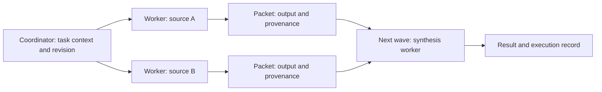

# Concurrent workers and context waves

The follow-up [accuracy and evidence-DNA milestone](ACCURACY.md) adds source-aware
acceptance and reports the new expansion evaluation. Its packet schema and
truncation handling supersede the original unrestricted parent-output flow below.

This milestone adds a Rust coordinator with multiple resident neural workers.
Independent requests can execute concurrently. A declared dependency graph can
also carry intermediate results into later waves. The existing neural controller
and dashboard remain separate entry points.

Here, **wave** means a dependency level in a task graph. **Data DNA** is the
working name for a bounded, versioned context packet. These are software
structures, not a physical wave transport or a biological encoding.



Workers claim available tasks from a shared queue within each wave. Later waves
start after the current wave finishes. Each worker owns one persistent model
process; each process handles one request at a time. Branches are declared by
the caller, rather than discovered or trained by this coordinator.

## Run the real comparison

From `window`, using the existing local checkpoint and `.venv-neural`:

```powershell
python run_network.py --workers 2 --device cpu --repeats 3 --cases 4 --generation-demo
```

CPU is explicit because two independent GPU replicas may not fit this machine's
8 GB GPU. There is no automatic device fallback. Each CPU replica uses the
existing runtime's four PyTorch threads and float32 weights. This tests dividing
one machine's CPU resources; it does not measure multi-GPU scaling.

The comparison rotates the order of four modes across repetitions:

| Mode | Workers executing | Work per question |
| --- | --- | --- |
| `serial_direct` | First worker | One full-evidence answer |
| `pool_direct` | All configured workers | Same direct questions through a shared queue |
| `serial_wave` | First worker | Two source answers followed by synthesis |
| `parallel_wave` | All configured workers | Same branches and synthesis in dependency waves |

Each question asks for the owners of two parcels. Direct and wave modes receive
the same source facts and final answer choices. The synthesis task receives the
actual source-worker answers; its instruction does not contain the expected
answer. Expected answers are used only for scoring. Source workers can be wrong,
and those errors can propagate to synthesis.

All modes use the same model/tokenizer fingerprints and a 100,000-token cap per
trial. All branch and synthesis tokens count. Unused replicas remain resident
during serial trials; this is a scheduling comparison with the same allocated
replicas, not a memory comparison against deploying only one model. Initialization
and warmup are reported separately. Other system workloads can affect timings.

`--generation-demo` additionally runs a proposal and constraint branch followed
by a synthesis, using actual greedy text generation. It saves text, token IDs,
and finish reasons. Length-limited text is not treated as proof of good reasoning.
There is no quality score for this demonstration.

## Evidence

Each invocation writes `results/network-<timestamp>-<id>/`:

- `config.json`: exact endpoint and workload configuration.
- `manifest.json`: source, executable, and configuration SHA-256 hashes.
- `report.json`: model identities, warmups, per-task requests and responses,
  parent packets, start/finish timings, token accounting, scores, and summaries.
- `summary.json`: aggregate comparison measurements.
- `status.json`, build logs, and `worker.stderr.log`: completion or failure evidence.

`completed` means the experiment executed within its checks, not that its answers
were correct. Accuracy is reported separately. Correct final questions per second
is the useful throughput metric; counting every branch as a solved question would
artificially favor decomposed workloads. Completion latency includes waiting from
the beginning of the submitted trial, while service time measures each worker call.

## Custom task graphs

Pass `--config path/to/config.json` to select endpoints and submit your own tasks.
When `tasks` is supplied, the CLI runs that graph instead of the comparison:

```json
{
  "workers": [
    {"name": "local", "kind": "local", "python": "C:/path/to/python.exe",
     "model": "C:/path/to/checkpoint", "device": "cpu"}
  ],
  "token_budget": 10000,
  "tasks": [
    {"id": "source", "context": "project-7", "revision": 1,
     "prompt": "Summarize this evidence: the library has two rooms.",
     "max_new_tokens": 48},
    {"id": "combine", "context": "project-7", "revision": 1,
     "parents": ["source"], "prompt": "Use the supplied result to propose a room assignment.",
     "max_new_tokens": 64}
  ]
}
```

Omit `candidates` for generation. Supply two to eight candidate strings for
conditional-likelihood ranking. Inputs remain subject to the existing model
worker's 1,024-token prompt limit; packets are not silently truncated.

Each packet identifies its task, context, revision, and immediate parent outputs,
including their worker and wave. The report preserves the complete chain of
records, so provenance can be followed without copying all ancestors into every
prompt. Different sessions or revisions cannot be connected implicitly.

This creates connections among context shards within a workflow. It does not
provide a larger native attention window, persistent distributed memory, or an
automatic way to merge contradictory source facts. Parent text is explicitly
labelled fallible evidence; that label is not a prompt-injection defense.

## Multiple machines through SSH

An endpoint can instead launch a worker through an existing SSH connection:

```json
{"name": "node-b", "kind": "ssh", "host": "user@node-b",
 "directory": "/srv/tron/window", "python": "/srv/tron/window/.venv-neural/bin/python",
 "model": "/srv/models/local-checkpoint", "device": "cuda"}
```

The remote example requires a POSIX shell, the worker code/runtime already
installed, and local checkpoint files on that host. SSH uses batch mode and
strict host-key checking. It does not install software, copy weights, or accept
unknown host keys. Request arguments are quoted for the remote shell. Windows
works as the coordinator/local-worker host; a Windows remote shell is not tested.

The local process-parent identity check is replaced by SSH's host authentication
for remote endpoints; response PID/sequence correlation and model fingerprints
remain checked. Fingerprints are reported by the authenticated worker, not remote
hardware attestation. A local timeout closes the SSH connection; immediate
termination of a currently executing remote model call is not guaranteed.

No second machine was available in this session. SSH command construction and
remote-handshake rules have unit tests; actual cross-machine execution and scaling
still require a multi-host experiment.

## Bounds and failures

The coordinator accepts 1–16 workers, at most 128 tasks, 32 waves, eight parents per
task, and 8,192 bytes per packet. It rejects duplicate IDs, cycles, missing parents,
and cross-context/revision edges before execution. Each request reserves its
maximum permitted token count before dispatch. A wave can reject work even if its
eventual actual cost would have fit; this conservative policy prevents overspend.

Model requests have a 60-second timeout. A failed request consumes its token
reservation because its actual computation may be unknown. Failed branches block
descendants while unrelated tasks can finish. There are no automatic retries,
worker replacement, migration, or persisted queue recovery in this milestone.

## Verification

```powershell
python -m unittest discover -s tests -p 'test_*.py'
cargo test --locked --offline
cargo clippy --locked --offline --all-targets -- -D warnings
cargo fmt -- --check
```

Scheduler fixtures explicitly use simulated responses and prove orchestration
behavior only. Real-model evidence comes from the separate launcher experiment.

## First measured result: 14 September 2026

Evidence: `results/network-20260914T125433Z-505d5d3b/`. Two distinct resident CPU
processes used the same DeepSeek-R1-Distill-Qwen-1.5B checkpoint. Each held
7,108,352,000 parameter bytes in float32. Startup plus warmup took 21.284 seconds.
Three repetitions of four questions produced these aggregate measurements:

| Mode | Correct final answers | Total response time | Tokens evaluated |
| --- | ---: | ---: | ---: |
| Serial direct | 3/12 | 56.401 s | 4,512 |
| Worker pool direct | 3/12 | 32.107 s | 4,512 |
| Serial waves | 3/12 | 108.314 s | 8,256 |
| Parallel waves | 3/12 | 62.396 s | 8,256 |

The direct worker pool was 1.76 times as fast as serial direct execution at the
same observed accuracy and token count. Parallel waves were 1.74 times as fast as
serial waves. Every parallel trial reached two in-flight calls; serial trials
reached one. These are measured gains from concurrent CPU execution on this
machine, not a prediction of linear scaling across machines.

Cooperation did not improve accuracy and used 1.83 times the direct tokens.
All four modes scored 25%, which is also the uniform-chance rate for the four
answer choices. Direct answers repeatedly selected `A, B`; the inspected first
wave trial's source branches repeatedly selected `A`, and synthesis returned
`A, A`. The model did not reliably use the supplied evidence in this workload.

The three generation tasks completed their model calls but all hit their token
limits. The constraint branch invented a reading-page requirement, and the
synthesis contained placeholders and repetition. This is evidence that generated
text passed between workers; it does not establish useful cooperative reasoning.

The current conclusion is therefore specific: concurrent execution works and
reduces elapsed time for this workload. Context packets and dependency waves
work mechanically. Better reasoning, useful larger-context recall, and an
advantage over a plain worker pool remain unproved.

## Reassessment and next acceptance criteria

A larger-queue check used 16 questions per mode, one repetition, and the same two
CPU workers: `results/network-20260914T130010Z-143f7e61/`.

| Mode | Correct final answers | Response time | Tokens evaluated |
| --- | ---: | ---: | ---: |
| Serial direct | 4/16 | 74.724 s | 6,208 |
| Worker pool direct | 4/16 | 43.676 s | 6,208 |
| Serial waves | 4/16 | 139.927 s | 11,248 |
| Parallel waves | 4/16 | 113.496 s | 11,248 |

The pool maintained a 1.71-times speedup. Parallel waves improved over serial
waves by 1.23 times, less than the smaller run's 1.74 times. This single larger
trial does not isolate the cause of the difference. Accuracy stayed at 25%.
The pool is the justified default for independent work; extra waves currently
add cost without a demonstrated answer-quality benefit.

Both runs completed with matching source manifests and no failed or blocked
tasks. Across the two experiments there were 224 comparison calls, three
generation calls, and four worker warmups. Fast verification passed 18 Python,
43 Rust, and five JavaScript tests, plus Clippy and formatting checks. Source and
test files remain within the 200-line limit.

1. **Establish reliable source answers.** Freeze a held-out evidence task set and
   compare suitable instruction/chat formatting with the current raw completion
   prompts. Score against a constant-answer baseline and include missing and
   contradictory evidence. Current 25% final accuracy is too weak to establish a
   reasoning benefit from any routing policy.
2. **Make connected context verifiable.** Extend packets with source references,
   confidence/validation state, and truncation status before using them as durable
   memory. Test revision changes and source retraction across waves. A synthesis
   should be checked against original evidence rather than accepting a plausible
   parent answer automatically.
3. **Measure physical scaling.** Repeat the identical workload on one and two
   machines with a fixed model/runtime and report communication cost, memory per
   replica, correct throughput, latency, and worker-loss behavior. The SSH adapter
   enables this experiment; it does not supply its result.
4. **Then test larger connected contexts.** Shard a corpus whose total size exceeds
   one worker's prompt limit, route questions to relevant shards, and compare with
   a competent retrieval-based worker pool. Measure cross-shard answer accuracy,
   provenance, and total tokens. This would test the proposed context-network
   benefit directly, without assuming that more connected packets improve recall.

This milestone does not yet connect the earlier adaptive memory controller to
the concurrent scheduler. Doing that before establishing reliable branch outputs
would make orchestration effects and learning effects difficult to separate.
